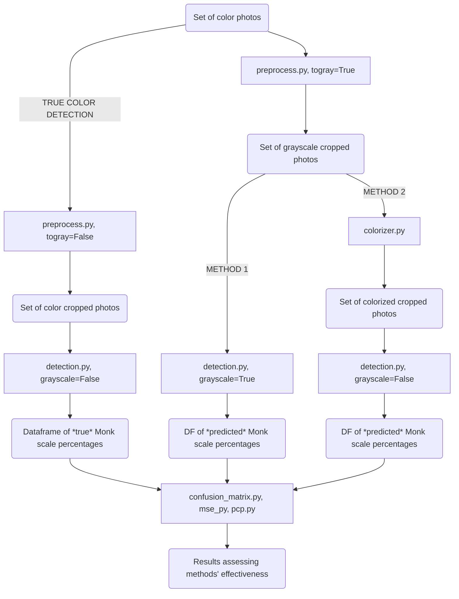

# Old Picture Complexion Detection

This project uses computer vision to identify complexion of people in black and white photos based on the Ellis Monk complexion scale (https://skintone.google/). This repository contains a variety of tools to support the analysis of photos, including: preprocessing photos of individuals by cropping to the subject's face, colorizing black and white photos, detecting the color composition of a photo (either color or black and white) based on the Monk scale, and assessing the accuracy of different methods to identify complexion. 


## Use Cases 

## Components

The following flow chart illustrates how our components work together to compare our two methods of identifying skin complexion. 



### Preprocesser (preprocess.py)

### Colorizer (colorizer/colorizer.py)

The colorization algorithm was developed by Zhang, et al, and is detailed here:

http://richzhang.github.io/colorization/

In order to run the demo, you will first need to download the pre-trained data from this location. At 125 MB it's too large to put into the GitHub. Place the file in the model folder.

https://www.dropbox.com/s/dx0qvhhp5hbcx7z/colorization_release_v2.caffemodel?dl=1


#### Steps to colorizing photos

1. Clone the repository:
```
git clone git@github.com:583-dsdt-team/tonelocator.git
```

2. Download the pre-trained caffe model from the Dropbox link above and place the downloaded model file in the *model* folder within the *colorizer* folder.

3. Place the black and white photos that you want to colorize in the *input* folder within the *colorizer* folder. 

4. Run python code from terminal:

```
python tonelocator/tonelocator/colorizer/colorizer.py
```

5. The colorized photos will appear in the *output* folder within the *colorizer* folder.


NOTE: All commands should be run from the folder in which the main *tonelocator* github repository was cloned into.


