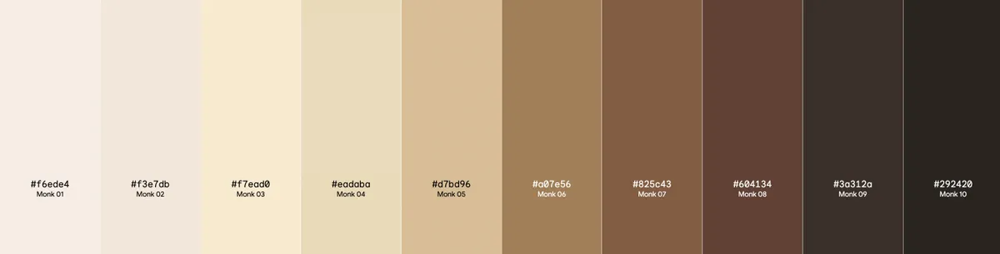

# Tone Locator

This project uses computer vision to identify complexion of people in black and white photos based on the Ellis Monk complexion scale (https://skintone.google/). This repository contains a variety of tools to support the analysis of photos, including: preprocessing photos of individuals by cropping to the subject's face, colorizing black and white photos, detecting the color composition of a photo (either color or black and white) based on the Monk skin tone scale, and assessing the accuracy of different methods to identify complexion in black and white photos. 


_The Monk scale._

## Use Cases 

We envision four primary use cases for these tools:

1: **Pre-process an image of a face.** In this use case, a user is interested in pre-processing a set of images, in order to crop the photos to faces so that skin complexion can be detected. 
* User loads set of photos
* Tool returns images cropped to faces

2: **Detect prevalence of Monk scale bins in color image.** In this use case, a user is interested in detecting the share of a photo that falls within each of the color bins in the Monk scale. The user has a set of color images and wishes to return a dataframe that indicates what proportion of the image matches each bin of the Monk scale. 
* User loads set of color photos
* Tool returns dataframe of composition across Monk scale

3: **Detect prevalence of Monk scale bins in B&W image.** In this case, a user is interested in detecing the share of a photo that falls within each of the color bins in the Monk scale, but only has a set of black & white images. The user wishes to assess what share of each image matches the grayscale version of each bin of the Monk scale. 
* User loads set of black & white photos
* Tool returns dataframe of estimated composition across color Monk scale

4: **Test the effectiveness of different methods of colorizing.** In this case, a user is interested in assessing different methods of determining Monk Scale bin prevalence in black & white photos. The research team (Breon, David, and Lizzy) applied this use case -- we were interested in testing our two methods, as described on our poster and below. This use case could also apply to those who develop their own method of colorizing old photos and want to compare across methods.
* User loads set of true and predicted Monk scale composition values
* Tool returns confusion matrix, percent correctly predicted, and overall MSE and MSE by bin

## Components

The following flow chart illustrates how our components work together to compare our two methods of identifying skin complexion. 


### Preprocesser (preprocess.py)

This module takes photos of people and returns the photos cropped, and grayscale if requested. 

### Colorizer (colorizer/colorizer.py)

The colorization algorithm was developed by Zhang, et al, and is detailed here:

http://richzhang.github.io/colorization/

In order to run the demo, you will first need to download the pre-trained data from this location. At 125 MB it's too large to put into the GitHub. Place the file in the model folder.

https://www.dropbox.com/s/dx0qvhhp5hbcx7z/colorization_release_v2.caffemodel?dl=1

#### Steps to colorizing photos

1. Clone the repository:
```
git clone git@github.com:583-dsdt-team/tonelocator.git
```

2. Download the pre-trained caffe model from the Dropbox link above and place the downloaded model file in the *model* folder within the *colorizer* folder.

3. Place the black and white photos that you want to colorize in the *input* folder within the *colorizer* folder. 

4. Run python code from terminal:

```
python tonelocator/tonelocator/colorizer/colorizer.py
```

5. The colorized photos will appear in the *output* folder within the *colorizer* folder.

NOTE: All commands should be run from the folder in which the main *tonelocator* github repository was cloned into.


### Detector (detector.py)

This module ... 

Future iterations will have the ability to set your own color scale 

### Compare predicted color distribution to true distribution

Three modules produce different results that illustrate how well a given predicted color composition matches a true color distribution. 

#### conf_matrix.py

This module...

#### pcp.py

This module...

#### mse.py

This module...

## Get Started

To get a sense of how these tools work separately and together, clone the repository and open the Jupyter Notebook compare_detection_methods.ipynb in examples. This notebook walks through how we assessed the true Monk Scale composition of a set of color photos, tried two different methods of detecting Monk Scale composition from black & white photos, and compared how each method performed. 
