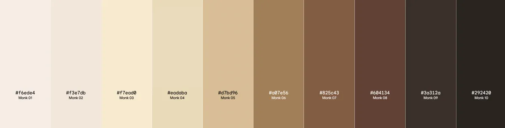

## Functional design: use cases

* Inputs
* Outputs

**Use case 1:** Crop picture to face

This use case is a pre-processing component of the skin tone detection use cases, but could also be used on its own. 
* Input: Set of image files
* Output: Set of image files cropped to face

**Use case 2:** Guess skin tone bin

In this use case, users upload black and white photos and receive a single "most probable" skin tone bin per photo. 
* Input: Set of image files
* Output: 

**Use case 3:** Produce probability distribution of skin tones 

In this use case, users upload black and white photos and receive a single "most probable" skin tone bin per photo. 
* Input: Set of image files
* Output: 
